# AI Multi-Agent Tutoring Chatbot 🎓

[](https://www.python.org/downloads/)
[](https://fastapi.tiangolo.com/)
[](https://ai.google.dev/)
[](https://opensource.org/licenses/MIT) An intelligent, multi-agent AI tutoring system designed to provide personalized assistance in Mathematics and Physics. This project leverages Google's Agent Development Kit (ADK) principles, the Gemini API for advanced language understanding, and a modular architecture for extendability.

## ✨ Features

* **Multi-Agent Architecture**: A central Tutor Orchestrator agent delegates tasks to specialized Math and Physics agents.
* **Intelligent Query Classification**: Automatically determines the subject of a student's query (Math, Physics, or General).
* **Specialized Agents**:
    * **Math Agent**: Solves mathematical problems, explains concepts, and uses a built-in calculator tool.
    * **Physics Agent**: Explains physics concepts, looks up physical constants and formulas using dedicated tools.
* **Tool Usage**: Agents utilize tools to perform specific tasks:
    * Calculator for mathematical computations.
    * Lookup for physical constants and formulas.
    * Conversation history and learning progress tracking.
* **Conversation History & Context Management**: Agents remember previous interactions within a session to provide context-aware and personalized responses.
* **Learning Progress Tracking**: The system can track a student's understanding level of different concepts.
* **Web Interface**: A user-friendly chat interface built with FastAPI and basic HTML/CSS/JavaScript.
* **Powered by Gemini API**: Utilizes Google's Gemini models for natural language understanding and response generation.

## 🏛️ System Architecture

This AI Tutor is built on a multi-agent system design, inspired by Google's Agent Development Kit (ADK) principles. The architecture emphasizes modularity, tool usage, and intelligent orchestration.

```mermaid
graph LR
    UserInterface["🌐 Web Interface (FastAPI + HTML/JS)"] -->|User Query| APIServer[" FastAPI App (app.py)"];
    APIServer -->|Process Query| OrchestrationEntryPoint["MultiAgentTutoringSystem (main.py)"];

    subgraph MATS_Subgraph [Multi-Agent Tutoring System Orchestration]
        direction LR
        OrchestrationEntryPoint -->|Initial Query| TutorOrchestratorAgent["👤 Tutor Orchestrator Agent"];
        TutorOrchestratorAgent -- uses --> ClassifierTool["classify_student_query (Tool)"];
        ClassifierTool -- runs --> InternalClassifierAgent["🤖 Internal Query Classifier Agent (LLM)"];
        
        TutorOrchestratorAgent -- uses --> ConversationHistoryToolsGroup["📚 Conversation History Tools"];
        
        OrchestrationEntryPoint -- If Math Query --> MathSpecialistAgent["✖️ Math Specialist Agent"];
        OrchestrationEntryPoint -- If Physics Query --> PhysicsSpecialistAgent["🔬 Physics Specialist Agent"];
        OrchestrationEntryPoint -- If General Query --> TutorOrchestratorAgent;

        MathSpecialistAgent -- uses --> CalculatorToolInstance["🧮 Calculator Tool"];
        MathSpecialistAgent -- uses --> ConversationHistoryToolsGroup;
        PhysicsSpecialistAgent -- uses --> ConstantsFormulasToolInstance["🔍 Constants & Formulas Tool"];
        PhysicsSpecialistAgent -- uses --> ConversationHistoryToolsGroup;
    end

    subgraph AllTools [Tools]
        direction TB
        CalculatorToolInstance
        ConstantsFormulasToolInstance
        ConversationHistoryToolsGroup
        ClassifierTool
    end
    
    TutorOrchestratorAgent -->|LLM Interaction| GeminiAPI["🧠 Gemini API"];
    MathSpecialistAgent -->|LLM Interaction| GeminiAPI;
    PhysicsSpecialistAgent -->|LLM Interaction| GeminiAPI;
    InternalClassifierAgent -->|LLM Interaction| GeminiAPI;

    style UserInterface fill:#D6EAF8,stroke:#333,stroke-width:2px
    style APIServer fill:#D1F2EB,stroke:#333,stroke-width:2px
    style OrchestrationEntryPoint fill:#FCF3CF,stroke:#333,stroke-width:2px
    style MATS_Subgraph fill:#FEF9E7,stroke:#CCC,stroke-width:1px,color:#333
    style AllTools fill:#FDEDEC,stroke:#CCC,stroke-width:1px,color:#333
    style GeminiAPI fill:#E8DAEF,stroke:#333,stroke-width:2px
```


## 🛠️ Technology Stack

* **Backend**: Python, FastAPI
* **AI/LLM**: Google Gemini API
* **Agent Framework**: Principles and components inspired by Google Agent Development Kit (ADK)
* **Frontend**: HTML, CSS, JavaScript (via FastAPI templating)
* **Core Libraries**: `pydantic` (for settings), `python-dotenv`

## 🚀 Setup and Installation

### Prerequisites

* Python 3.9+
* Access to Google Gemini API and a valid API Key.

### Steps

1.  **Clone the repository**:
    ```bash
    git clone <your-repository-url>
    cd <repository-name>
    ```

2.  **Create and activate a virtual environment**:
    ```bash
    python -m venv venv
    # Windows
    # .\venv\Scripts\activate
    # macOS/Linux
    source venv/bin/activate
    ```

3.  **Install dependencies**:
    ```bash
    pip install -r requirements.txt
    ```

4.  **Set up environment variables**:
    Create a `.env` file in the project root by copying `.env.example` (if provided) or creating it manually. Add your Gemini API key:
    ```env
    GEMINI_API_KEY="YOUR_GEMINI_API_KEY_HERE"
    HOST="0.0.0.0"
    TUTOR_PORT=8000
    # Other config variables from config.py can also be set here
    ```

## ▶️ Running the Application

Once the setup is complete, run the FastAPI application using Uvicorn:

```bash
uvicorn app:app --host 0.0.0.0 --port 8000 --reload
```

## 💬 Usage

* **Web Interface**: Open `http://localhost:8000` in your web browser to interact with the AI Tutor via a chat interface.
* **API Endpoint**: The chat functionality is also available at the `POST /api/chat` endpoint. You can use tools like `curl` or Postman to interact with it.
    * **Request Body**:
        ```json
        {
            "message": "Your question here",
            "student_id": "optional_student_identifier"
        }
        ```
    * **Health Check**: `GET /api/health`
    * **Agent Status**: `GET /api/agents/status` (Note: This endpoint may need to be updated to reflect actual agent health if it's just showing the tutor port currently).

## ☁️ Deployment

This application is built with FastAPI and is suitable for deployment on various platforms that support Python ASGI applications, such as:

* Vercel
* Railway
* Google Cloud Run
* AWS Elastic Beanstalk
* Heroku

Ensure your `GEMINI_API_KEY` and other necessary environment variables are configured on the deployment platform.

## 💡 Future Enhancements

* Persistent storage for conversation history and learning progress (SQLite, PostgreSQL, or a NoSQL option).
* More sophisticated context retrieval mechanisms (vector embeddings for semantic search of conversation history, Reinforcement Learning guided Multi Agent RAG Pipeline (inspired by this paper (https://arxiv.org/abs/2501.15228)), Chain of Thought with Validation Loops).
* Support for more subjects and more advanced tools.
* User authentication and distinct profiles for personalized long-term learning.
* Streaming responses for a more interactive and real-time chat experience.
* Enhanced error handling and logging for production readiness.
* UI/UX improvements based on user feedback.
